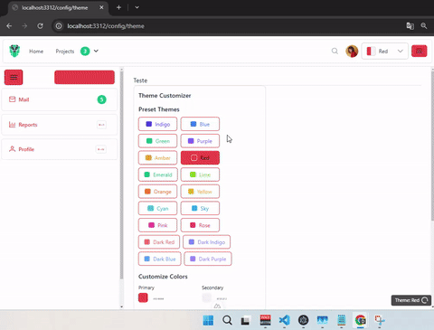

This project demonstrates a full integration between Nuxt 3, Electron, and PrimeVue, including a robust theme customization system powered by Pinia. It provides a solid foundation for building cross-platform desktop applications with a modern web UI.

<div align="center" style="margin:20px; width: 100%;">
    </img>
</div>

```markdown
# Nuxt 3, Electron, and PrimeVue with Theme Customization

This project demonstrates a full integration between Nuxt 3, Electron, and PrimeVue, including a robust theme customization system powered by Pinia.  It provides a solid foundation for building cross-platform desktop applications with a modern web UI.

### autor :  [@vytorsouzadev](https://github.com/vytorsouzadev)


## Table of Contents

1.  [Introduction](#introduction)
2.  [Technologies Used](#technologies-used)
3.  [Project Structure](#project-structure)
4.  [Getting Started (Cloning and Running)](#getting-started)
5.  [Development Commands](#development-commands)
6.  [Theme Customization](#theme-customization)
7.  [File Explanations](#file-explanations)
    *   [`package.json`](#packagejson)
    *   [`nuxt.config.ts`](#nuxtconfigts)
    *   [`tailwind.config.js`](#tailwindconfigjs)
    *   [`app/stores/theme.ts`](#appstorestheme-ts)
8.  [Building for Production](#building-for-production)

## 1. Introduction <a name="introduction"></a>

This application combines the power of Nuxt 3 for building the user interface, Electron for creating a desktop application wrapper, and PrimeVue for a rich set of UI components.  The project also incorporates Tailwind CSS for utility-first styling and Pinia for state management, specifically used here for managing the application's theme.  The theme system allows users to switch between pre-defined themes (including light and dark variations) and provides a mechanism for adding custom themes.

## 2. Technologies Used <a name="technologies-used"></a>

*   **Nuxt 3:** A Vue.js framework for building modern web applications, providing server-side rendering (SSR), static site generation (SSG), and a great developer experience.
*   **Electron:** A framework for building cross-platform desktop applications with JavaScript, HTML, and CSS. It allows you to use web technologies to create native-like desktop experiences.
*   **PrimeVue:** A comprehensive UI component library for Vue.js, offering a wide range of pre-built components like buttons, inputs, data tables, and more.
*   **Tailwind CSS:** A utility-first CSS framework that provides a set of pre-defined classes to style your application quickly and consistently.
*   **Pinia:** The recommended state management library for Vue.js, offering a type-safe and intuitive way to manage application state.
*   **Electron Forge:** A complete tool for creating, publishing, and installing modern Electron applications.  It simplifies the build process and provides tools for creating installers for different operating systems.
*   **unplugin-vue-components:** Automatically imports Vue components on demand, improving build performance and reducing bundle size.  It's used here with the `PrimeVueResolver` to automatically import PrimeVue components.
*   **concurrently:**  Allows running multiple npm scripts concurrently, useful for starting both the Nuxt development server and the Electron process.
*   **cross-env:**  Ensures environment variables are set consistently across different operating systems.
*   **animate.css**: A library of ready-to-use, cross-browser animations for use in your web projects.
*  **axios**:Promise based HTTP client for the browser and node.js

## 3. Project Structure <a name="project-structure"></a>

The project follows a fairly standard Nuxt 3 structure, with some key additions for Electron and theme management:

```
.
├── app/                  # Main Nuxt application directory
│   ├── assets/           # CSS, images, and other static assets
│   ├── components/       # Vue components
│   ├── layouts/          # Nuxt layouts
│   ├── pages/            # Nuxt pages (routes)
│   ├── plugins/         # Nuxt plugins (PrimeVue, Animate.css)
│   └── stores/           # Pinia stores (theme.ts)
├── electron/             # Electron-related files (main process, etc.)
├── nuxt.config.ts        # Nuxt 3 configuration file
├── package.json          # Project dependencies and scripts
├── tailwind.config.js    # Tailwind CSS configuration
└── readme.md             # This file
```

## 4. Getting Started (Cloning and Running) <a name="getting-started"></a>

1.  **Clone the repository:**

    ```bash
    git clone <repository_url>
    cd <project_directory>
    ```

2.  **Install dependencies:**

    ```bash
    npm install
    ```

## 5. Development Commands <a name="development-commands"></a>

*   **`npm run dev`**: Starts the Nuxt development server.  This will launch the application in your browser, and you'll be able to make changes and see them hot-reloaded.  The port is dynamically set using `process.env.PORT` if available, otherwise, it will use a default port.

*   **`npm run electron:dev`**:  Builds the Nuxt application (using `nuxt generate`) and then starts the Electron application in development mode. This command uses Electron Forge's `start` script.  This allows you to see your Nuxt application running within the Electron wrapper.

*   **`npm run electron:server`** : Runs both Nuxt dev server and electron-forge concurrently in development mode using PORT 3312

## 6. Theme Customization <a name="theme-customization"></a>

The application provides a powerful theme customization system managed by the `app/stores/theme.ts` Pinia store.

*   **Pre-defined Themes:**  The store includes a variety of pre-defined themes, including light and dark variations based on common colors (Indigo, Blue, Green, Purple, Amber, Red, Emerald, Lime, Orange, Yellow, Cyan, Sky, Pink, Rose).  Each theme defines:
    *   `id`: A unique identifier for the theme.
    *   `name`: A user-friendly name for the theme.
    *   `primevueTheme`:  The corresponding PrimeVue theme name (e.g., `lara-light-blue`).  This is crucial for ensuring PrimeVue components are styled correctly.
    *   `background`:  The main background color.
    *   `selectedBackground`: The background color for selected elements.
    *   `textColor`:  The primary text color.
    *   `linkColor`:  The color for links.
    *   `linkHoverColor`: The color for links on hover.
    *   `isDark`:  A boolean indicating whether the theme is a dark theme.

*   **Switching Themes:** The `setTheme(themeId)` action is used to switch between themes. It updates the `currentThemeId` in the store, applies the theme's CSS variables to the `documentElement`, and loads the corresponding PrimeVue theme using the `loadPrimeVueTheme` method. It also saves theme to localStorage.

*   **Applying Themes:** The `applyTheme()` action sets CSS custom properties (variables) based on the current theme's properties.  These variables (e.g., `--app-background`, `--app-text-color`) are then used in your CSS or component styles to apply the theme's colors. The action also adds or removes the `dark-theme` class to the `documentElement` to enable or disable dark mode styling.

*   **Loading PrimeVue Themes:** The `loadPrimeVueTheme(themeName)` action dynamically loads PrimeVue themes from a CDN.  It handles:
    *   Removing any existing PrimeVue theme links.
    *   Creating a new `<link>` element to load the specified theme.
    *   Using `onload` and `onerror` event handlers to ensure the theme is loaded correctly and to handle potential errors.  If a theme fails to load, it attempts to load a fallback theme (either `lara-dark-blue` or `lara-light-blue`).
    * Validation of PrimeVue theme.

*   **Adding Custom Themes:** The `addCustomTheme(theme)` action allows you to add new themes programmatically.  It checks for duplicate IDs to prevent conflicts.

* **initTheme**: Check localStorage, set currentThemeId. If no theme is saved it uses the system theme.

## 7. File Explanations <a name="file-explanations"></a>

### 7.1 `package.json` <a name="packagejson"></a>

This file defines the project's metadata, dependencies, and scripts.

*   **Dependencies:** Lists the production dependencies required for the application, including Nuxt 3, Electron, PrimeVue, Tailwind CSS, Pinia, and other supporting libraries.
*   **DevDependencies:** Lists the development dependencies, including tools for building and packaging the Electron application (Electron Forge), testing, and linting.
*   **Scripts:** Defines various commands for development, building, and packaging the application.  The key scripts are explained in the "Development Commands" section above.

### 7.2 `nuxt.config.ts` <a name="nuxtconfigts"></a>

This file configures the Nuxt 3 application.

*   **`srcDir: 'app/'`:**  Specifies that the main application code is located in the `app` directory.
*   **`modules`:**  Registers Nuxt modules, including `@nuxtjs/tailwindcss`, `@pinia/nuxt`, and `@vueuse/nuxt`.
*   **`css`:**  Defines global CSS files, including `main.scss`, `animate.css`, and PrimeVue's CSS files.
*   **`plugins`:** Registers Nuxt plugins.
*   **`build.transpile`:**  Ensures that `primevue` is properly transpiled, which is necessary for some components.
*   **`vite.plugins`:**  Configures Vite plugins.  Here, it uses `unplugin-vue-components` with `PrimeVueResolver` to automatically import PrimeVue components.
*   **`app`:** Configure the application's page and layout transitions, setting them to 'page' and 'layout' respectively, with an 'out-in' mode.
*   **`compatibilityDate`: '2024-11-01'**: sets the date to ensure compatibility and prevent future breaking changes within a specific timeframe.

### 7.3 `tailwind.config.js` <a name="tailwindconfigjs"></a>

This file configures Tailwind CSS.

*   **`content`:** Specifies the files that Tailwind should scan for classes.  This includes components, layouts, pages, plugins, `app.vue`, and `error.vue`.
*   **`theme.extend`:** Extends the default Tailwind theme with custom font sizes and spacing values.

### 7.4 `app/stores/theme.ts` <a name="appstorestheme-ts"></a>

This file defines the Pinia store for managing the application's theme. It's explained in detail in the "Theme Customization" section above.

## 8. Building for Production <a name="building-for-production"></a>

To build the application for production, you'll need to run the following command **as an administrator**:

```bash
npm run electron:build
```

This command will:

1.  Generate a production-ready build of your Nuxt application (using `nuxt generate`).
2.  Use Electron Forge's `make` command to package your application into platform-specific installers (e.g., `.exe` for Windows, `.dmg` for macOS, `.deb` for Debian/Ubuntu).

The output installers will be located in the `out` directory. Running this command as an administrator is crucial, especially on Windows, to ensure that Electron Forge has the necessary permissions to create the installers.
```